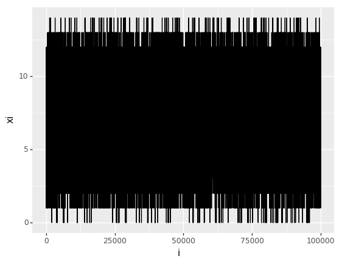

# Introduction to MCMC
## Markov chain Monte Carlo
#### Martin Burke, September 2018

Markov chain Monte Carlo (MCMC) methods... ADD BLURB

This article assumes a basic familiarity with Monte Carlo methods, and in particular rejection sampling. See the [introduction to Monte Carlo methods](https://mjb3.github.io/Discuit.jl/latest/monte_carlo_intro/monte_carlo_intro/) article for a basic overview.

## Metropolis-Hastings algorithm

The Metropolis-Hastings algorithm is another method of obtaining samples from $F$. Like the basic rejection sampler it draws samples from a proposal distribution and accepts them with a given probability. However in this case the denominator of the acceptance probability equation is the previous sample $x_i$, which is also the basis for the next proposal. 
For example, in the simple rejection sampler we made proposals independently by drawing a random number between two and twelve. In this example we shall propose the new state $x_f$ by drawing a random number (which may be positive or negative) and adding it to $x_i$.


```python
# import some stuff for random number generation, analysis and plotting
import numpy as np
import pandas as pd
from plotnine import *
from plotnine.data import *

# likelihood function
def correct_likelihood(z):
    comb = 6 - abs(z - 7)
    return comb * 1/36


# likelihood estimator
def dodgy_likelihood(z):
    like = correct_likelihood(z)
    pert = (np.random.random() - 0.5) * 0.1
    return max(like + pert, 0)
```

    /usr/lib/python3.6/importlib/_bootstrap.py:219: RuntimeWarning: numpy.dtype size changed, may indicate binary incompatibility. Expected 96, got 88
      return f(*args, **kwds)
    /usr/lib/python3.6/importlib/_bootstrap.py:219: RuntimeWarning: numpy.dtype size changed, may indicate binary incompatibility. Expected 96, got 88
      return f(*args, **kwds)


```python
# metropolis hastings algorithm
PROPOSAL = 8    # jump size


def met_hastings_alg(steps, likelihood_function):
    #initialise
    xi = 2
    lik_xi = likelihood_function(xi)
    lik_err = lik_xi - correct_likelihood(xi)
    markov_chain = list()
    num_accept = 0
    # get some samples
    for x in range(1, steps + 1):
        # propose new state
        xf = xi + np.random.randint(-PROPOSAL, PROPOSAL+1)
        # evaluate likelihood
        lik_xf = likelihood_function(xf)
        # accept with mh probability
        accept = False
        mh_prop = lik_xf / lik_xi
        if mh_prop > 1:
            # accept automatically
            accept = True
        else:
            # accept sometimes
            if np.random.random() < mh_prop:
                accept = True
        # add sample to mc
        if accept:
            num_accept = num_accept + 1
        rowi = (x, xi, lik_xi, xf, lik_xf, accept, num_accept / x, lik_err)
        markov_chain.append(rowi)
        # update xi
        if accept:
            xi = xf
            lik_xi = lik_xf
            lik_err = lik_xi - correct_likelihood(xi)
    # create data frame and return
    return pd.DataFrame(markov_chain, columns=["i", "xi", "lik_xi", "xf", "lik_xf", "accept", "ar", "lik_err"])
```


```python
# run markov chain 
mc = met_hastings_alg(100000, dodgy_likelihood)
print(mc)
trace = ggplot(mc, aes(x = "i", y = "xi")) + geom_line()
p = ggplot(mc, aes(x = "xi", y = "..density..")) + geom_histogram(binwidth=1)
print(trace)
```

                i  xi    lik_xi  xf    lik_xf  accept        ar   lik_err
    0           1   2  0.018845   8  0.093632    True  1.000000 -0.008933
    1           2   8  0.093632   6  0.171441    True  1.000000 -0.045257
    2           3   6  0.171441  11  0.009422   False  0.666667  0.032552
    3           4   6  0.171441   6  0.091026   False  0.500000  0.032552
    4           5   6  0.171441   0  0.000000   False  0.400000  0.032552
    5           6   6  0.171441  14  0.000000   False  0.333333  0.032552
    6           7   6  0.171441  10  0.053377    True  0.428571  0.032552
    7           8  10  0.053377  15  0.000000   False  0.375000 -0.029956
    8           9  10  0.053377   8  0.179336    True  0.444444 -0.029956
    9          10   8  0.179336   0  0.000000   False  0.400000  0.040447
    10         11   8  0.179336   1  0.000000   False  0.363636  0.040447
    11         12   8  0.179336   4  0.060740   False  0.333333  0.040447
    12         13   8  0.179336   4  0.114071    True  0.384615  0.040447
    13         14   4  0.114071  -2  0.000000   False  0.357143  0.030737
    14         15   4  0.114071   1  0.004771    True  0.400000  0.030737
    15         16   1  0.004771  -1  0.000000   False  0.375000  0.004771
    16         17   1  0.004771  -1  0.000000   False  0.352941  0.004771
    17         18   1  0.004771   0  0.000000   False  0.333333  0.004771
    18         19   1  0.004771   7  0.191727    True  0.368421  0.004771
    19         20   7  0.191727  10  0.077846   False  0.350000  0.025060
    20         21   7  0.191727  12  0.052756   False  0.333333  0.025060
    21         22   7  0.191727   7  0.157793    True  0.363636  0.025060
    22         23   7  0.157793   6  0.106944   False  0.347826 -0.008873
    23         24   7  0.157793   2  0.006802    True  0.375000 -0.008873
    24         25   2  0.006802  -5  0.000000   False  0.360000 -0.020976
    25         26   2  0.006802  -1  0.000000   False  0.346154 -0.020976
    26         27   2  0.006802   0  0.000000   False  0.333333 -0.020976
    27         28   2  0.006802  -1  0.000000   False  0.321429 -0.020976
    28         29   2  0.006802  -6  0.000000   False  0.310345 -0.020976
    29         30   2  0.006802   1  0.000000   False  0.300000 -0.020976
    ...       ...  ..       ...  ..       ...     ...       ...       ...
    99970   99971   9  0.159789   4  0.069303   False  0.440208  0.048677
    99971   99972   9  0.159789   5  0.114957    True  0.440213  0.048677
    99972   99973   5  0.114957   4  0.084242   False  0.440209  0.003846
    99973   99974   5  0.114957   3  0.027291    True  0.440214  0.003846
    99974   99975   3  0.027291  -3  0.000000   False  0.440210 -0.028265
    99975   99976   3  0.027291  -2  0.000000   False  0.440206 -0.028265
    99976   99977   3  0.027291   0  0.000000   False  0.440201 -0.028265
    99977   99978   3  0.027291  11  0.073115    True  0.440207 -0.028265
    99978   99979  11  0.073115  18  0.000000   False  0.440202  0.017560
    99979   99980  11  0.073115  19  0.000000   False  0.440198  0.017560
    99980   99981  11  0.073115  12  0.013020   False  0.440194  0.017560
    99981   99982  11  0.073115  12  0.032099   False  0.440189  0.017560
    99982   99983  11  0.073115  11  0.092939    True  0.440195  0.017560
    99983   99984  11  0.092939   6  0.102638    True  0.440200  0.037384
    99984   99985   6  0.102638   5  0.127289    True  0.440206 -0.036251
    99985   99986   5  0.127289   1  0.000000   False  0.440202  0.016178
    99986   99987   5  0.127289  11  0.066883    True  0.440207  0.016178
    99987   99988  11  0.066883  17  0.000000   False  0.440203  0.011328
    99988   99989  11  0.066883  10  0.125619    True  0.440208  0.011328
    99989   99990  10  0.125619   2  0.007658   False  0.440204  0.042286
    99990   99991  10  0.125619  15  0.000000   False  0.440200  0.042286
    99991   99992  10  0.125619   6  0.098521    True  0.440205  0.042286
    99992   99993   6  0.098521  10  0.069860   False  0.440201 -0.040368
    99993   99994   6  0.098521   3  0.026114   False  0.440196 -0.040368
    99994   99995   6  0.098521  13  0.000000   False  0.440192 -0.040368
    99995   99996   6  0.098521   1  0.049607    True  0.440198 -0.040368
    99996   99997   1  0.049607   4  0.092572    True  0.440203  0.049607
    99997   99998   4  0.092572   3  0.074566    True  0.440209  0.009239
    99998   99999   3  0.074566  -2  0.000000   False  0.440204  0.019011
    99999  100000   3  0.074566  -2  0.000000   False  0.440200  0.019011
    
    [100000 rows x 8 columns]





    <ggplot: (8731147382536)>

