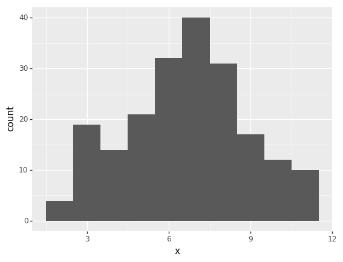
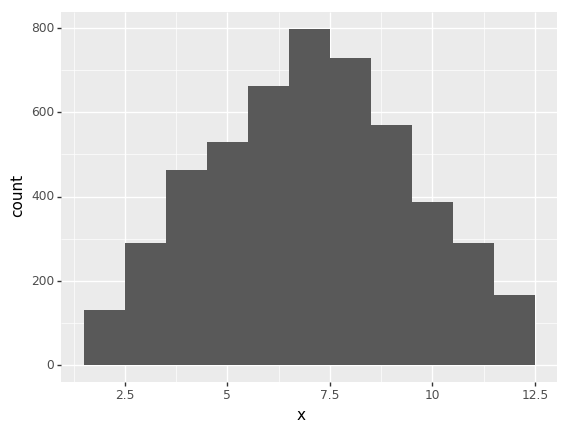
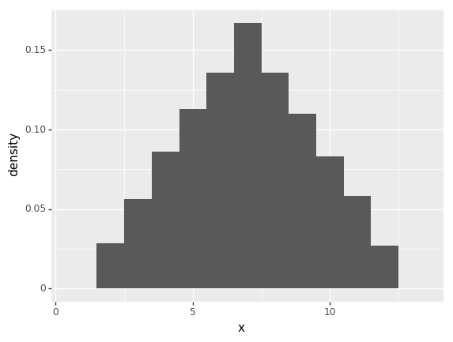
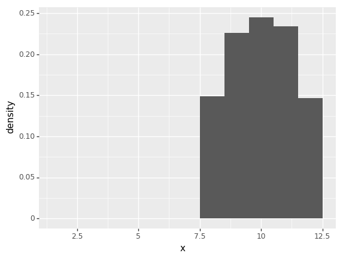

# Introduction to Monte Carlo methods
## Sampling from discrete probability distributions
#### Martin Burke, August 2018

Monte Carlo methods are a way of drawing samples from probability distributions (they are also used for problems such as optimization and computing integrals). In the examples below the (not so) difficult to sample distribution of interest is ``X``: the outcome in a game of dice where the score ``x = d_1 + d_2`` is the sum of two fair dice and the likelihood of any given score is denoted $f(x)$.

Different sampling algorithms can be understood in terms of the challenges and requirements they are designed to accomodate. In some situations we may know enough about the system to draw directly (i.e. simulate) from $X$. In others we may be restricted to computing the probability mass function (PMF) $f(x)$; an unbiased approximation $\hat{f}(x)$; or some quantity proportional to the likelihood $q \propto f(x)$. We may also be interested in specific regions or scenarios concerning the target distribution such as the likelihood rolling 10 or more. More formally, we might wish to evaluate $\int_{10}^{12} f(x) dx$.


| Problem | Algorithms |
|---------|-----------|
| Draw directly from $X$  | Plain Monte Carlo |
| Can only compute $f(x)$, $\hat{f}(x)$ or $q \propto f(x)$  | Rejection, Importance sampling |
| Need to compute $\int_{a}^{b} f(x) dx$ | Importance sampling |


## Plain Monte Carlo

The first sampler is for situations where we know enough about the target distribution to draw samples directly. To do this we use our knowledge of the data generating process to define a function which draws two random numbers distributed uniformly from one to six and returns the sum:


```python
# import some stuff for random number generation, analysis and plotting
import numpy as np
import pandas as pd
from plotnine import *
from plotnine.data import *


# draw directly from X
def dat_gen_function():
    x = np.random.randint(1, 7)
    y = np.random.randint(1, 7)
    return x + y
```

    /usr/lib/python3.6/importlib/_bootstrap.py:219: RuntimeWarning: numpy.dtype size changed, may indicate binary incompatibility. Expected 96, got 88
      return f(*args, **kwds)
    /usr/lib/python3.6/importlib/_bootstrap.py:219: RuntimeWarning: numpy.dtype size changed, may indicate binary incompatibility. Expected 96, got 88
      return f(*args, **kwds)


The algorithm itself is a simple one: it iteratively calls the function (passed as a parameter 'f') for a given number of steps. Each sample is appended to a list which is returned as a pandas data frame.


```python
# example 1) monte carlo
def plain_monte_carlo(steps, f):
    # get some samples
    samples = list()
    for i in range(0, steps):
        x = f()
        # create a tuple and append to list
        sample = (i, x)
        samples.append(sample)
    # create data frame and return
    return pd.DataFrame(samples, columns=["i", "x"])
```

We can now run the algorithm and plot the results.


```python
s = plain_monte_carlo(200, dat_gen_function)
p = ggplot(s, aes("x")) + geom_histogram(binwidth=1)
print(p)
```





    <ggplot: (-9223363266560229737)>


Note that as the number of steps is increased the random noise in the distribution of samples obtained is reduced. That is, they converge upon the true target distribution: $X$.

### Rejection sampling

In situations where sampling from $X$ directly is difficult we may still be able to obtain samples if we are able to compute the PMF of the target distribution: $f(x)$ or an unbiased estimate. The rejection sampling method accomplishes this by drawing $x$ from some other easier to sample proposal distribution $G$ and accepting or rejecting the sample with probability: $$pr(accept) = \frac{f(x)}{C g(x)}$$ where C is a constant chosen such that $f(x) < C g(x)$ for all $x$. Naturally since C is a constant this method works equally well in situations where it is more convenient to compute a quantity proportional to the likelihood. We will therefore begin by defining a function which returns the likelihood multiplied by an arbitrary "unknown" constant: $q(x)$:


```python
# arbitrary constant
UC = 2


# proportional quantity likelihood function
def function_q_x(x):
    comb = 6 - abs(x - 7)
    return comb * 1/36 * UC
```

The algorithm is similar to the first but this time a likelihood function (or in this case $q(x)$) is passed as the function parameter. The proposal distribution $G$ is uniform between two and twelve. This is computationally convenient in the sense that we only have to evaluate $g(x)$ once but also somewhat wasteful in that many proposals are rejected. The choice of proposal distribution is therefore an important factor in algorithm efficiency but not one that we shall explore in detail here.


```python
# example 2) rejection sampler
def rejection_sampler(steps, likelihood_function):
    # compute C * g(x)
    m_gx = 4 * 1/11     # C is chosen such that g(x) always > q(x)
    # get some samples
    samples = list()
    for i in range(1, steps + 1):
        # draw from proposal dist (uniform ~ 2, 12)
        x = np.random.randint(2, 13)
        # compute acceptance probability
        pr_a = likelihood_function(x) / m_gx
        # accept (or not)
        if np.random.random() < pr_a:
            sample = (i, x)
            samples.append(sample)
    # return as pandas data frame
    return pd.DataFrame(samples, columns=["i", "x"])
```

Note that in contrast to the previous example each iteration of the algorithm involves two probabistic steps: the proposal itself and the additional step of accepting or rejecting with the computed probability.


```python
s = rejection_sampler(10000, function_q_x)
p = ggplot(s, aes("x")) + geom_histogram(binwidth=1)
print(p)
```





    <ggplot: (-9223363266560262119)>


NEED TO ADD acceptance rate commentary.

### Importance sampling

The first two examples provided methods for drawing samples from $X$ in different situations. Importance sampling algorithms by contrast are designed to draw samples from the proposal density $G$ and weight them so as to recover information about $X$. First we consider the basic concept and then apply it to a slightly more difficult problem to understand why this might sometimes be useful.

#### Basic example

The proposal density used here is uniform from one to thirteen (i.e. we shall assume that we are not particularly good at choosing proposals):


```python
# 3.1) importance sampling: basic concept
def simple_importance_sampler(steps, likelihood_function):
    # get some samples
    samples = list()
    for i in range(1, steps + 1):
        # draw from proposal dist (uniform ~ 1, 13)
        x = np.random.randint(1, 14)
        # weight sample by target dist
        # (since the g(x) is uniform we disregard for now)
        w = likelihood_function(x)
        sample = (i, x, w)
        samples.append(sample)
    # create data frame and return
    return pd.DataFrame(samples, columns=["i", "x", "w"])
```

We can now run the sampler using the likelihood function we already defined:


```python
s = simple_importance_sampler(10000, function_q_x)
p = ggplot(s, aes(x = "x", y = "..density..", weight = "w")) + geom_histogram(binwidth=1)
print(p)
```





    <ggplot: (8770292352604)>


#### Payoff example

We now consider a slightly more complex problem to better illustrate the usefulness of importance sampling. Let $h(x)$ be a function that defines the payoff in a game of dice in a pretend casino. The player wins by rolling nine or more with the winnings being double the stake on nine; triple on ten and so on. The house wins if the player rolls seven or less and eight is a draw, i.e.the player keeps their stake.


```python
# payoff function
def function_h_x(x):
    if x < 8:
        return 0
    else:
        return x - 7
```

We are now interested in finding the expected value of the pay off. More formally, we wish to evaluate the following integral: $$\int_{8}^{12} h(x) f(x) dx$$

We shall also assume that we are in a position to compute an unbiased estimate of the full likelihood $\hat{f}(x)$:


```python
# likelihood function (not directly used)
def correct_likelihood(x):
    comb = 6 - abs(x - 7)
    return comb * 1/36


# likelihood estimator
def dodgy_likelihood(x):
    like = correct_likelihood(x)
    pert = (np.random.random() - 0.5) * 0.1
    return max(like + pert, 0)

```

Note the updated weight calculation which accounts for the proposal density in addition to the estimated likelihood and the pay off function:


```python
# 3.2) importance sampling: pay off example
def payoff_importance_sampler(steps, p1, p2, likelihood_function, pay_off_fn):
    # get some samples
    samples = list()
    for i in range(1, steps + 1):
        # draw from proposal dist (uniform ~ p1, p2)
        x = np.random.randint(p1, p2 + 1)
        # weight sample by f(x) / g(x) * h(x) 
        w = likelihood_function(x) * (p2 - p1 + 1) * pay_off_fn(x)
        sample = (i, x, w)
        samples.append(sample)
    # create data frame and return
    return pd.DataFrame(samples, columns=["i", "x", "w"])
```

Note that the proposal distribution $G$ is still uniform but is now parameterised. We begin by sampling using a better (but still not very good) proposal distribution, uniform on the range of possible outcomes.


```python
s = payoff_importance_sampler(1000, 2, 12, dodgy_likelihood, function_h_x)
ev = s["w"].mean()
print("expected payoff: {}".format(ev))
p = ggplot(s, aes(x = "x", y = "..density..", weight = "w")) + geom_histogram(binwidth=1)
print(p)
```

    expected payoff: 0.952266074554924





    <ggplot: (8770292352590)>


Running the algorithm we notice that samples obtained for proposals less than eight are essentially wasted since they do not contribute to the information we are able to recover about the expected payoff. We can therefore change the proposal density to only select from the desired range in order to improve the efficiency of the algorithm:


```python
s = payoff_importance_sampler(1000, 8, 12, dodgy_likelihood, function_h_x)
ev = s["w"].mean()
print("expected payoff: {}".format(ev))
p = ggplot(s, aes(x = "x", y = "..density..", weight = "w")) + geom_histogram(binwidth=1)
print(p)
```

    expected payoff: 1.0208390815997577


    <ggplot: (-9223363266560253703)>


We can also test the performace gain by computing the average error overone hundred runs for a given number of samples from each proposal density:


```python
true_payoff = 35/36
results = list()
for i in range(0, 100):
    s1 = payoff_importance_sampler(1000, 2, 12, dodgy_likelihood, function_h_x)
    err1 = abs(true_payoff - s1["w"].mean())
    s2 = payoff_importance_sampler(1000, 8, 12, dodgy_likelihood, function_h_x)
    err2 = abs(true_payoff - s2["w"].mean())
    results.append((err1, err2))
results = pd.DataFrame(results, columns=["err1", "err2"])
print("First proposal average error: {}".format(results["err1"].mean()))
print("Second proposal average error: {}".format(results["err2"].mean()))
```

    First proposal average error: 0.03659525816683872
    Second proposal average error: 0.015996746454680775


Unsurprisingly the average error is lower for the narrower proposal range. This demonstrates that importance sampling is a useful option for exploiring specific regions of the target distribution. This is a useful property with a range of applications from financial risk models to predicting the frequency of rare events in climate models.

## Summary

This document introduced three basic classes of Monte Carlo algorithm in the context of drawing (independent) samples from a discrete probability distribution and touched upon the related problem of solving integrals. The next notebook introduces a more advanced class of Monte Carlo methods which draw future samples based on the current sample (i.e. dependent) to form a Markov chain (MCMC).
